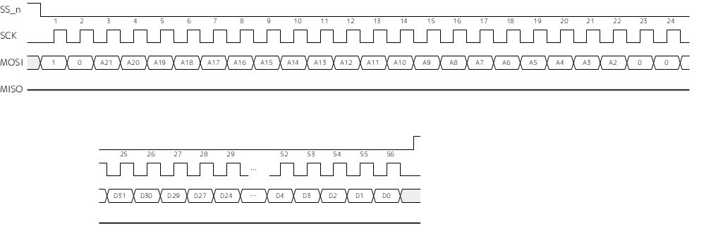
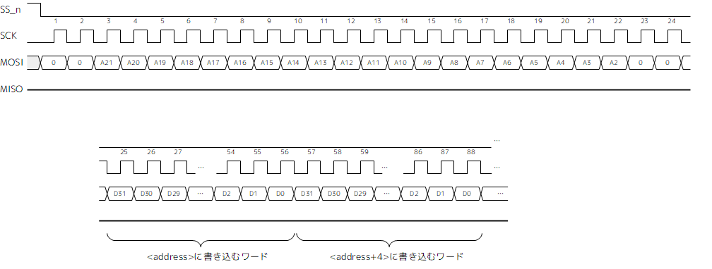

CASKET EVAKIT クイックドキュメント
================================

# ■ 概要
CASKET EVAKITは、電飾衣装向け制御モジュール NGC4755 の評価用ボードです。

# ■ ボード説明
ボード上U1（NGC4755モジュール）に実装されているチップは割れやすいため、取り扱いには十分注意してください。

[回路図 (PDF)](lib/casket_pcb_rev.a_schm.pdf)

## コネクタ説明
- 電源コネクタ (CN1)  
ボード電源を入力します。電圧は5V、電流は接続する機器に合わせて2～10Aの電源を接続してください。

- PORT-Aコネクタ (CN5～10)  
CH0～5はシリアルLED専用の出力チャネルです。WS2812B/SK6812のLEDテープを1チャネルあたり256個まで駆動できます。

- PORT-Bコネクタ (CN11)  
CH6～11はシリアルLED／RCサーボ／GPIO／アナログ出力(1bitΔΣ-DAC)のマルチファンクションチャネルです。コネクタ形状はJRタイプの3ピンRCサーボコネクタになっています。  
  - 白：信号出力
  - 赤：+5V
  - 黒：GND

- PORT-Cコネクタ (CN4)  
CH6～11のGPIO入力用チャネルです。GPIOファンクションで入力機能を使う場合、または外部トリガ入力を使う場合はこのコネクタに接続し、機能選択ジャンパでモジュールピンへの接続を切り替えます。

- 機能選択ジャンパ (JP3～JP8)
CH6～11の入出力を切り替えるジャンパピンです。GPIOファンクションで入力を選択した場合に、該当チャネルへの入力を切り替えます。接続詳細については回路図を確認してください。

- SPI I/Fコネクタ (CN2)  
制御用のSPIスレーブ端子です。ホストMCUと接続してNGC4755のコントロールを行います。制御の詳細についてはNGC4755のマニュアルを参照してください。

---

# ■ NGC4755リファレンス
NGC4755はSPIインターフェースでホストMCUと通信を行います。SPIモード0で、クロックは最大10MHzです。詳細については[SPIインターフェース信号タイミング](#SPIインターフェース信号タイミング)の項を参照してください。

## ペリフェラルマップ
ペリフェラル詳細についてはリンク先のドキュメントを参照してください。

|アドレス|範囲(ワード)|ペリフェラル|詳細|
---|---|---|---
|0x000000|4|[CERASITE SYSUID](lib/cerasite_sysuid_doc_r1_j.pdf)||
|0x000020|8|[CERASITE PIO](lib/cerasite_pio_doc_r1_j.pdf)|CH6～11までの6チャネル分でインスタンスされています|
|0x000080|32|[PERIDOT SERVO](https://github.com/osafune/peridot_peripherals/blob/master/doc/peridot_servo_doc_r2_j.pdf)|CH6～11までの6チャネル分でインスタンスされています|
|0x000100|8|[PERIDOT LED](https://github.com/osafune/peridot_peripherals/blob/master/doc/peridot_led_doc_r4_j.pdf)|PERIDOT LEDペリフェラルの制御レジスタ(CSR)|
|0x008000|8192|PERIDOT LED|PERIDOT LEDペリフェラルのピクセルメモリ(MEM)|
||

### NGC4755固有の設定
- CRASITE SYSUIDペリフェラル
  |レジスタ名|値|備考|
  ---|---|---
  |SYSUID|0x72A91000||
  |TIMECODE|1566657318|REV.A0190824での生成値|
  ||

- CERASITE PIOペリフェラル  
PIOファンクションはCH6～11までの6ポート分でインスタンスされています。DIN/DOUTとの対応は以下の通りです。
  |チャネル|PIOポート|
  ---|---
  |CH6|DIN[0] / DOUT[0]|
  |CH7|DIN[1] / DOUT[1]|
  |CH8|DIN[2] / DOUT[2]|
  |CH9|DIN[3] / DOUT[3]|
  |CH10|DIN[4] / DOUT[4]|
  |CH11|DIN[5] / DOUT[5]|
  ||

  また機能選択レジスタのマッピングは以下の通りです。
  |FUNCn|機能|
  ---|---
  |00|PIO|
  |01|PERIDOT LED|
  |10|PERIDOT SERVO のPWM|
  |11|CH6～9: PERIDOT SERVO のDSM CH10: 予約(0固定) CH11: PERIDOT LEDの割り込み出力|
  ||

- PERIDOT SERVOペリフェラル  
サーボ数はCH6～11までの6チャネル分でインスタンスされています。機能割り当てはPIOペリフェラルのFUNCnレジスタで設定します。
  |チャネル|サーボ出力|DSM(アナログ出力)|
  ---|---|---
  |CH6|PWM0|dsm_out[0]|
  |CH7|PWM1|dsm_out[1]|
  |CH8|PWM2|dsm_out[2]|
  |CH9|PWM3|dsm_out[3]|
  |CH10|PWM4|なし|
  |CH11|PWM5|なし|
  ||

- PERIDOT LEDペリフェラル  
PERIDOT LEDファンクションは下記のパラメータで生成されています。
  |生成時パラメータ|設定値|
  ---|---|
  |チャネル数|12|
  |チャネル当たりのLED数|256|
  |外部トリガ機能|あり|
  |レイヤー合成機能|あり|
  |エフェクト機能|あり|
  ||

  全12チャネルのうち、CH0～5 はシリアルLED専用です。CH6～11 はPIOペリフェラルのFUNCnレジスタで設定します。  
  外部トリガはCH6～11の6本から入力することができます。マッピングは下記の通りです。
  |チャネル|外部トリガ選択レジスタ(SEL)設定値|
  ---|---
  |CH6|0110|
  |CH7|0111|
  |CH8|1000|
  |CH9|1001|
  |CH10|1010|
  |CH11|1011|
  ||
  ※この機能を使う場合は、該当のチャネルをPIOの入力モードに設定しておかなければなりません。

## SPIインターフェース
### 信号タイミング

| 名前 | min | typ | max | 単位 | 内容 |
---|---|---|---|---|---
|TDAC|10|||ns|SS_Nアサート→最初のSCLKの立ち上がりまでの時間|
|TDCN|5|||ns|最後のSCLKの立ち下がり→SS_Nネゲートまでの時間|
|TDNA|40|||ns|SS_Nネゲート→次のSS_Nアサートまでの時間|
|TWHC|5|||ns|SCLKの'H'期間|
|TWLC|5|||ns|SCLKの'L'期間|
|TCLK|||10|MHz|SCLKの周波数|
|TSU|1|||ns|MOSIのデータセットアップ時間|
|THD|0|||ns|MOSIのデータホールド時間|
|TDZO||TBD||ns|MISOのHi-Z→データ出力までの時間|
|TDO||TBD||ns|MISOの有効データ出力までの時間|
|TDOZ||TBD||ns|MISOのデータ出力→Hi-Zまでの時間|
||

### SPIインターフェースプロトコル
NGC4755はSPIモード0で動作します。  

|アクセスタイプ|アドレスバイト|ダミーバイト|データバイト(32bit単位)|
---|---|---|---
|シングルリード|3|1|4|
|シングルライト|3|0|4|
|マルチリード|3|1|4×n|
|マルチライト|3|0|4×n|
||

アドレスバイトではアクセスタイプとアクセスするアドレスを指定します。アドレス範囲は 0x000000～0x3FFFFF を指定することができます。アクセスは常に32bit単位で行われるため、アドレスの下位2bitは常に0を指定します。  
アクセスタイプがマルチリードまたはマルチライトの場合、アドレスバイトで指定したアドレスを先頭に4バイト（データワード単位）ごとにインクリメントしてアクセスを行います。

ダミーバイトはシングルリードまたはマルチリードの場合に、アドレスバイトの後に挿入します。

データバイトはリードまたはライトを行うデータワードで、常に32bit単位でアクセスします。

- シングルリード  

- シングルライト  

- マルチリード  

- マルチライト  

---

# ■ ライセンス

[The MIT License (MIT)](https://opensource.org/licenses/MIT)  
(C) 2019 J-7SYSTEM WORKS LIMITED.
